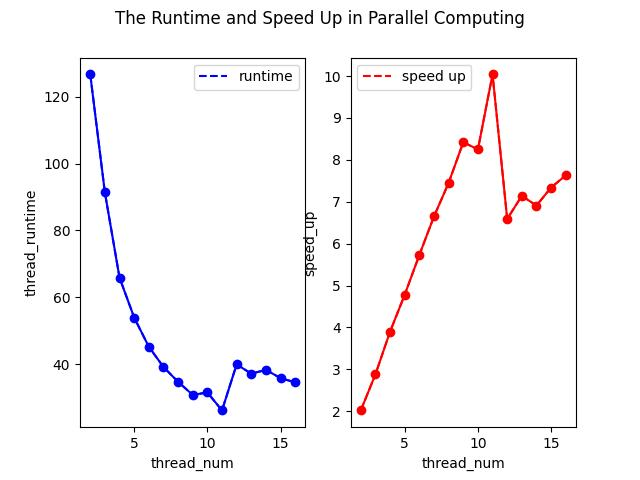

## 针对Program1的分析

### 1. 使用两个处理器并行化Mandelbrot的生成

通过将Mandelbrot进行简单的上下分块，接着分别将两块给不同的线程可以实现并行计算。实现代码如下：

```cpp
if (args->threadId == 0)
     {
         mandelbrotSerial(args->x0, args->y0, args->x1, args->y1, args->width, args->height, 0, args->height / 2, args->maxIterations, args->output);
     }
     if (args->threadId == 1)
     {
         mandelbrotSerial(args->x0, args->y0, args->x1, args->y1, args->width, args->height, args->height / 2, args->height / 2, args->maxIterations, args->output);
    }
```

### 2. 扩展代码支持2，3，4，5，6，7，8个线程。

对图像的划分参照1中的思路进行横向的长块划分。实现代码如下：

```cpp
mandelbrotSerial(args->x0, args->y0, args->x1, args->y1, args->width, args->height, args->height / args->numThreads * args->threadId, args->height / args->numThreads, args->maxIterations, args->output);
```

另外，以线程数和执行时间、线程数和加速比为横纵坐标画出y随x的变化曲线来分析执行效率和线程数的关系。

其中VIEW 1的线程数函数如下所示：


VIEW 2的线程数函数如下所示：


从整体趋势可以看出，随着线程数的增加，运行时间减少，加速比逐渐增加。对应到图中的斜率变化可以看到，在前期(thread_num<8)的提升幅度较大，后期(thread_num>8)的幅度逐渐减小。总体的趋势是呈现线性变化，这与我的假设也是相符的。

然而有一个数据点显然出现了问题，VIEW 1的线程3。可以观察到他的runtime反常地增加了。我们知道处理器只有四个核心，但每个核心支持两个超线程，因此它总共可以执行八个线程交错其执行内容。因此可能的原因是线程调度的开销大于用多线程计算节省的开销，这会导致虽然线程增加了，但实际上并没有性能的提升。在考虑到这一点后，VIEW 1中的一个特征也能得到解释：在前期线程数3到4、5到6、7到8的时候性能明显增加，而前期线程数2到3、4到5、6到7的时候性能提升不大。原因也是从2到3、4到5、6到7，操作系统需要频繁地在核心之间切换线程，这就增加了线程调度的开销，使得性能提升不明显。而对于VIEW 2，说明线程调度的开销相比于增加线程计算节省的开销来说很小，因此在线程数增加的时候，运行时间明显随之减少，没有反常的现象。

### 3. 测量每个线程完成工作量的时间：

通过在workerThreadStart()的开头和结尾插入计时代码

| cycles/thread_num | 2              runtime                    | 3          runtime                                                                  | 4           runtime                                                                                          | 5           runtime                                                                                                                     | 6             runtime                                                                                                                                           | 7          runtime                                                                                                                                                                          | 8          runtime                                                                                                                                                                                                  |
| ----------------- | ------------------------------------------------ | ---------------------------------------------------------------------------------------- | ------------------------------------------------------------------------------------------------------------------ | --------------------------------------------------------------------------------------------------------------------------------------------- | ---------------------------------------------------------------------------------------------------------------------------------------------------------------------- | ------------------------------------------------------------------------------------------------------------------------------------------------------------------------------------------------ | ------------------------------------------------------------------------------------------------------------------------------------------------------------------------------------------------------------------------ |
| 1                 | thread 1  [215.461]ms<br />thread 0  [215.508]ms | thread 0  [84.983]ms<br />thread 2  [85.855]ms <br />***thread 1  [255.133]ms*** | thread 3  [41.887]ms<br />thread 0  [42.549]ms<br />***thread 1  [178.435]ms<br />thread 2  [178.654]ms*** | thread 4  [19.716]ms<br />thread 0  [19.870]ms<br />***thread 1  [111.428]ms<br />thread 3  [114.711]ms<br />thread 2  [174.162]ms*** | thread 0  [12.065]ms<br />thread 5  [13.166]ms<br />thread 4  [77.315]ms<br />thread 1  [78.161]ms<br />***thread 2  [132.704]ms<br />thread 3  [133.519]ms*** | thread 0  [8.929]ms<br />thread 6  [10.724]ms<br />thread 1  [52.657]ms<br />thread 5  [53.871]ms<br />thread 2  [97.577]ms<br />thread 4  [100.834]ms<br />**thread 3  [130.186]ms**      | thread 0  [6.239]ms<br />thread 7  [6.944]ms<br />thread 6  [34.500]ms<br />thread 1  [35.762]ms<br />thread 5  [72.193]ms<br />thread 2  [72.455]ms<br />***thread 4  [107.689]ms<br />thread 3  [108.262]ms*** |
| 2                 | thread 0  [213.144]ms<br />thread 1  [215.866]ms | thread 0  [84.190]ms<br />thread 2  [86.832]ms<br />***thread 1  [257.328]ms***  | thread 0  [39.432]ms<br />thread 3  [39.748]ms<br />***thread 2  [168.555]ms<br />thread 1  [169.586]ms*** | thread 0  [19.236]ms<br />thread 4  [20.011]ms<br />***thread 3  [113.904]ms<br />thread 1  [114.348]ms<br />thread 2  [173.280]ms*** | thread 0  [12.918]ms<br />thread 5  [12.967]ms<br />thread 1  [73.540]ms<br />thread 4  [73.683]ms<br />***thread 2  [131.921]ms<br />thread 3  [133.024]ms*** | thread 6  [9.441]ms<br />thread 0  [9.773]ms<br />thread 1  [52.355]ms<br />thread 5  [52.171]ms<br />thread 2  [96.734]ms<br />thread 4  [97.674]ms<br />**thread 3  [127.330]ms**        | thread 0  [7.599]ms<br />thread 7  [8.010]ms<br />thread 1  [36.756]ms<br />thread 6  [37.380]ms<br />thread 5  [73.784]ms<br />thread 2  [76.252]ms<br />***thread 3  [108.404]ms<br />thread 4  [110.805]ms*** |
| 3                 | thread 0  [210.743]ms<br />thread 1  [211.344]ms | thread 0  [85.712]ms<br />thread 2  [86.192]ms<br />***thread 1  [255.639]ms***  | thread 0  [41.211]ms<br />thread 3  [42.119]ms<br />***thread 1  [177.486]ms<br />thread 2  [177.686]ms*** | thread 4  [19.739]ms<br />thread 0  [20.144]ms<br />***thread 1  [112.373]ms<br />thread 3  [113.101]ms<br />thread 2  [173.249]ms*** | thread 5  [11.833]ms<br />thread 0  [12.095]ms<br />thread 1  [75.883]ms<br />thread 4  [75.517]ms<br />***thread 2  [131.649]ms<br />thread 3  [134.595]ms*** | thread 0  [10.322]ms<br />thread 6  [10.433]ms<br />thread 1  [49.641]ms<br />thread 5  [53.575]ms<br />thread 2  [97.424]ms<br />thread 4  [101.022]ms<br />**thread 3  [128.754]ms**     | thread 7  [7.059]ms<br />thread 0  [7.474]ms<br />thread 1  [35.614]ms<br />thread 6  [36.761]ms<br />thread 5  [72.407]ms<br />thread 2  [73.488]ms<br />***thread 4  [106.311]ms<br />thread 3  [107.266]ms*** |
| 4                 | thread 0  [211.817]ms<br />thread 1  [212.777]ms | thread 0  [83.526]ms<br />thread 2  [83.908]ms<br />***thread 1  [251.400]ms***  | thread 0  [41.777]ms<br />thread 3  [43.642]ms<br />***thread 1  [176.864]ms<br />thread 2  [178.332]ms*** | thread 0  [18.789]ms<br />thread 4  [19.919]ms<br />***thread 1  [115.219]ms<br />thread 3  [115.250]ms<br />thread 2  [176.370]ms*** | thread 0  [12.391]ms<br />thread 5  [12.958]ms<br />thread 4  [76.798]ms<br />thread 1  [79.836]ms<br />***thread 2  [134.202]ms<br />thread 3  [134.915]ms*** | thread 0  [9.808]ms<br />thread 6  [10.102]ms<br />thread 1  [51.864]ms<br />thread 5  [53.258]ms<br />thread 2  [98.065]ms<br />thread 4  [99.655]ms<br />***thread 3  [126.882]ms***   | thread 7  [7.516]ms<br />thread 0  [7.686]ms<br />thread 1  [34.071]ms<br />thread 6  [35.130]ms<br />thread 2  [72.025]ms<br />thread 5  [72.405]ms<br />***thread 4  [106.932]ms<br />thread 3  [107.468]ms*** |
| 5                 | thread 0  [208.303]ms<br />thread 1  [209.655]ms | thread 2  [85.478]ms<br />thread 0  [86.667]ms<br />***thread 1  [259.418]ms***  | thread 3  [41.604]ms<br />thread 0  [42.188]ms<br />***thread 1  [178.782]ms<br />thread 2  [179.066]ms*** | thread 4  [19.894]ms<br />thread 0  [20.895]ms<br />***thread 3  [109.842]ms<br />thread 1  [110.481]ms<br />thread 2  [168.791]ms*** | thread 5  [11.470]ms<br />thread 0  [11.580]ms<br />thread 1  [76.709]m<br />sthread 4  [78.035]ms<br />***thread 2  [132.809]ms<br />thread 3  [135.507]ms*** | thread 0  [8.554]ms<br />thread 6  [10.816]ms<br />thread 1  [53.129]ms<br />thread 5  [55.375]ms<br />thread 4  [101.800]ms<br />thread 2  [102.136]ms<br />***thread 3  [132.583]ms*** | thread 0  [6.493]ms<br />thread 7  [7.702]ms<br />thread 1  [36.196]ms<br />thread 6  [37.717]ms<br />thread 2  [73.673]ms<br />thread 5  [74.722]ms<br />***thread 3  [110.170]ms<br />thread 4  [112.393]ms*** |
| total             | [209.795] ms                                     | [251.539] ms                                                                             | [169.749] ms                                                                                                       | [169.090] ms                                                                                                                                  | [133.380] ms                                                                                                                                                           | [127.369] ms                                                                                                                                                                                     | [107.610] ms                                                                                                                                                                                                             |

上面的表格统计了每个线程在5次循环中的工作时间。其中工作时间最长的线程已经加粗斜体标出。

可以清楚地看到每个线程完成工作所需的时间量差别是很大的。可能涉及以下几个因素：

* 工作负载不平衡：图像的不同区域具有不同的计算复杂度或像素密度，那么分配给灭个线程的工作量可能差异较大。一些线程可能需要处理更多的像素或更复杂的计算任务，而其他线程可能处理相对较少或更简单的任务。这种不平衡会导致某些线程的工作时间长，而其他线程很快完成工作。
* 线程调度和资源竞争：线程的调度和资源竞争也会对工作时间产生影响。操作系统负责将线程分配给可用的处理器核心，并控制线程之间的切换。线程之间的竞争可能会导致一些线程在某些时刻无法获得足够的处理器时间，从而延长其完成工作所需的时间。
* 缓存效应：现代处理器通常具有多级缓存，而不同线程访问的数据可能在缓存中有不同的命中率。如果线程访问的数据不在缓存中，就会发生缓存失效，需要从主存中加载数据，这会导致延迟增加。

这也可以印证我的假设，虽然总体趋势呈现线性变化，但是在幅度的改变上并不是严格遵循线性变化，因为上述因素都会影响整体的工作时间。

### 4. 修改工作到线程的映射

我采取了一种简单的策略对工作进行再分配，即将图片的每一行分解成一个任务，把每一个任务循环分配给线程（0,1, ... i），通过精细化任务的粒度来尝试平衡负载。实现代码如下：

```cpp
double times[args->numThreads];
    for (int i = args->threadId; i < args->height; i += args->numThreads)
    {
        double startTime = CycleTimer::currentSeconds();
        mandelbrotSerial(args->x0, args->y0, args->x1, args->y1, args->width, args->height, i, 1, args->maxIterations, args->output);
        double endTime = CycleTimer::currentSeconds();
        double runtime = endTime - startTime;
        times[args->threadId] += runtime;
    }
    printf("Hello world from thread %d runtime [%.3f]ms\n", args->threadId, times[args->threadId] * 1000);
```

在VIEW 1上的加速为 7.08，在VIEW 2上的加速为 7.14。(8线程)

优化后的VIEW 1的线程数函数如下所示：


优化后的VIEW 2的线程数函数如下所示：



### 5. 16线程性能分析

从结果看出，16线程的性能与8线程持平，并没有明显高于8线程。可能的原因有:

* 资源竞争：由于处理器核心数量有限，超过核心数的线程将竞争有限的计算资源，如处理器缓存、内存带宽等。当线程数超过核心数时，可能会引入更多的资源竞争，导致性能下降。
* 调度开销：线程的调度和切换会引入一定的开销。当线程数超过可用核心数时，操作系统需要更频繁地在不同线程之间进行切换，这会增加调度开销，降低性能。
* 超线程可能带来的问题：尽管处理器支持超线程技术，但它仅模拟了额外的逻辑核心，并不能提供完全独立的执行能力。超线程的性能提升有限，当线程数超过物理核心数时，超线程可能无法提供额外的性能增益。
