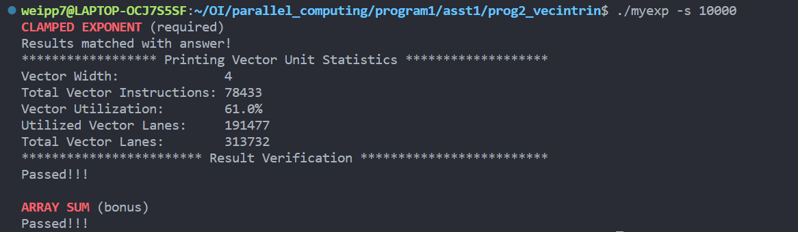
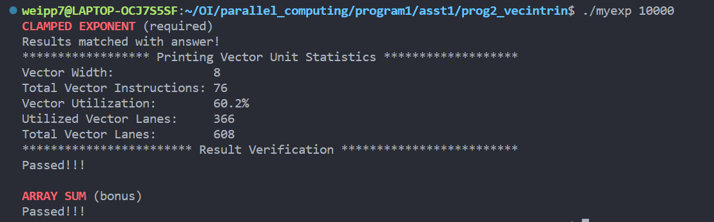
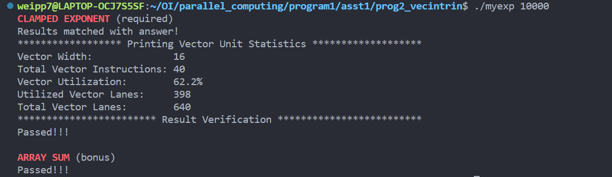

## 针对Program2的分析

### 1. 实现矢量化版本的clampedExpVector()

能够满足数组大小N和矢量宽度VECTOR_WIDTH的任意组合。实现思路是对N进行VECTOR_WIDTH大小的分组，若N不能整除VECTOR_WIDTH,则多分配一个组的空间给new N，使得new N是VECTOR_WIDTH的整数倍。之后对所得的结果取new N的前N位即为正确的output。实现代码在main.cpp中，在此不再赘述。

### 2. 分析矢量利用率

以下是矢量利用率随VECTOR_WIDTH的变化

VECTOR_WIDTH = 2


VECTOR_WIDTH = 4



VECTOR_WIDTH = 8



VECTOR_WIDTH = 16



通过观察可以看出，在矢量宽度为2的时候矢量利用率最高，而4，8，16的时候矢量利用率则差不多且都有所降低。可能原因是代码中的数据依赖性和并行性比较适合2个元素的矢量化。

在给定的代码中，每个循环迭代通过加载2个连续的float类型值到矢量寄存器中，并执行相应的矢量化指令（幂值计算）。矢量化指令可以同时对这两个值进行操作，从而实现并行计算。因此，在矢量宽度为2时，可以完全利用矢量化指令的并行性，从而实现较高的矢量利用率。

然而，当矢量宽度增加到4、8、16时，可能会遇到以下情况：

* 数据依赖性增加：随着矢量宽度的增加，较大的数据集合可能引入更多的数据依赖性，限制了指令级并行性。这可能导致某些指令必须等待前面的指令完成后才能执行，从而降低矢量利用率。在这里的可能情况为：在一组矢量并行计算的时候，大部分数据都快速完成，只有某几组数据需要大量的计算，这就导致其余的数据都在等待这些数据计算完成，有大量的并行资源置空，降低利用率。
* 内存访问模式变化：较大的矢量宽度可能要求更大的内存带宽来支持连续的数据访问。如果内存访问模式无法满足矢量化指令的要求，可能会导致矢量利用率下降。


### 3. arraySumVector的实现

具体实现代码如下：

```cpp
float arraySumVector(float *values, int N)
{

  //
  // CS149 STUDENTS TODO: Implement your vectorized version of arraySumSerial here
  //
  __cs149_vec_float x;
  __cs149_vec_float result;
  __cs149_mask maskAll;
  float output = 0.f;
  // int num = 0, group = N / VECTOR_WIDTH + (N % VECTOR_WIDTH ? 1 : 0);
  // float *Value = new float[group * VECTOR_WIDTH];
  // memset(Value, 0, sizeof(float) * group * VECTOR_WIDTH);
  // for (int i = 0; i < N; i++)
  // {
  //   Value[i] = values[i];
  // }

  maskAll = _cs149_init_ones();
  _cs149_vset_float(result, 0.f, maskAll); // float sum = 0;

  for (int i = 0; i < N; i += VECTOR_WIDTH)
  {
    maskAll = _cs149_init_ones();
    _cs149_vload_float(x, values + i, maskAll);
    _cs149_vadd_float(result, result, x, maskAll); // sum += values[i];
  }
  // for (int i = 0; i < VECTOR_WIDTH; i++)
  // {
  //   output += result.value[i];
  // }
  for (int i = VECTOR_WIDTH; i > 1; i /= 2)
  {
    _cs149_hadd_float(result, result);
    _cs149_interleave_float(result, result);
  }
  output = result.value[0];

  return output;
}

```
